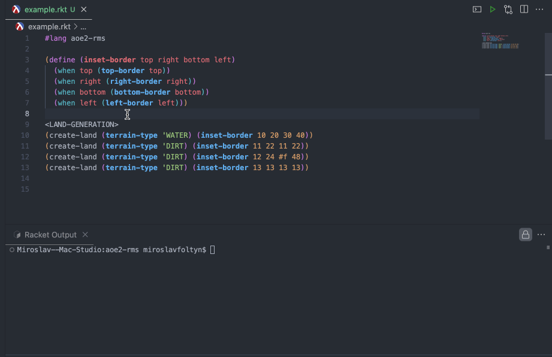

# aoe2-rms

This package implements a DSL for writing Age of Empires 2 Random Map Scripts in [Racket](https://racket-lang.org/).



\* *VSCode with Magic Racket extension installed*

## Getting Started

Assuming you have Racket installed, download this package by running:

```bash
raco pkg install aoe2-rms
```

Then convert any Racket file in `#lang aoe2-rms` to actual rms script simply by running it:

```bash
racket example.rkt
```

Optionally can write to an output file:

```bash
racket example.rkt -d example.rms
```

For syntax of the `#lang aoe2-rms` file and more, see [Documentation](https://docs.racket-lang.org/aoe2-rms). This package does not explain how random maps work in general however.

If you are interested in general documentation regarding authoring random maps for AoE2, please see the [Random Map Scripting Guide by Zetnus](https://docs.google.com/document/d/1jnhZXoeL9mkRUJxcGlKnO98fIwFKStP_OBozpr0CHXo/edit?tab=t.0), which contents heavily inspire the `aoe2-rms` documentation.

For some advanced stuff which would not be doable out of the box without the DSL, see [Recipes](https://docs.racket-lang.org/aoe2-rms/recipes.html).

## Versioning

This library is unstable.

Unfortunately, the [Racket Package Repository](https://pkgs.racket-lang.org/) does NOT support versioning for the artifacts it distributes, it only keeps track of the latest version (so pinning a version, which is actually not supported, wouldn't work either). This means that to obtain older versions one will have to build the package from source, which should not be hard, but one also has to hope transitive dependencies did not break backwards compatibility.

## Legal

This project is not affiliated with, endorsed by, or sponsored by developers of AoE2.
